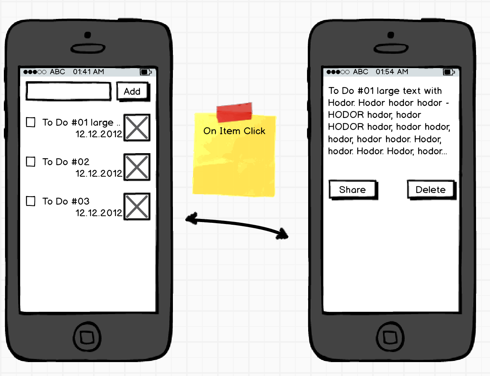

## Session 6: Android Activity and Intents
### [Presentation](Android_Activity_and_Intents.pdf)
### Task part 2

1. Create new class called DetailsActivity that extends Activity
2. Configure DetailsActivity in AndroidManifest.xml
3. Create layout file based on Mockup for DetailsActivity and configure it
4. Implement and set onItemClickListener for ListView
5. Create and start new internal Intent that will open DetailsActivity onItemClick
6. Put needed ToDoItem to Intent Data
7. Get Data from Intent in DetailsActivity onCreate and set it into Activity View's
8. Implement Delete button that should delete data from adapter and go back to MainActivity
9. Send an external SHARE Intent with ToDoItem text on Share Button click



### Code Examples

#### OnItemClick example
```java
    @Override
    public void onCreate(Bundle savedInstanceState) {
        super.onCreate(savedInstanceState);
        setContentView(R.layout.activity_my);

        ListView listView = (ListView) findViewById(R.id.listView);
        BaseAdapter adapter = new ArrayAdapter<String>(this,
                android.R.layout.simple_list_item_1, new String[] { "Item 1",
                "Item 2", "Item 2", "Item 3", "Item 4", "Item 5" });
        listView.setAdapter(adapter);
        listView.setOnItemClickListener(new AdapterView.OnItemClickListener() {
            @Override
            public void onItemClick(AdapterView<?> parent, View view, int position, long id) {
                Toast.makeText(MyActivity.this,
                        "ListItem number "+position+" clicked",
                        Toast.LENGTH_SHORT).show();
            }
        });
    }
```
#### In order for OnItemClick to work you need to ensure that there is no Focusable View in ListItem
For each CheckBox, Button, etc in ListItem layout you need to add ```android:focusable="false"```
``` xml

 <Button
        android:id="@+id/button"
        android:focusable="false"
        android:layout_width="wrap_content"
        android:layout_height="wrap_content" />

```

#### Internal Intent with Data that start new Activity
``` java
public void sendMessage(View view) {
    Intent intent = new Intent(this, DisplayMessageActivity.class);
    EditText editText = (EditText) findViewById(R.id.edit_message);
    String message = editText.getText().toString();
    intent.putExtra(EXTRA_MESSAGE, message);
    startActivity(intent);
}
```

#### How to get Intent data in newly started Activity
``` java
   @Override
    public void onCreate(Bundle savedInstanceState) {
        super.onCreate(savedInstanceState);
        setContentView(R.layout.activity_my);

        Intent intent = getIntent();
        String message = intent.getStringExtra("EXTRA_MESSAGE");
        TextView textView = (TextView) findViewById(R.id.textView);
        textView.setText(message);
    }
```

#### How to send external SHARE Intent
``` java
   Intent sharingIntent = new Intent(android.content.Intent.ACTION_SEND);
   sharingIntent.setType("text/plain");
   sharingIntent.putExtra(android.content.Intent.EXTRA_SUBJECT, "Subject Here");
   sharingIntent.putExtra(android.content.Intent.EXTRA_TEXT, "Message Body");
   startActivity(sharingIntent);
```

### Links
